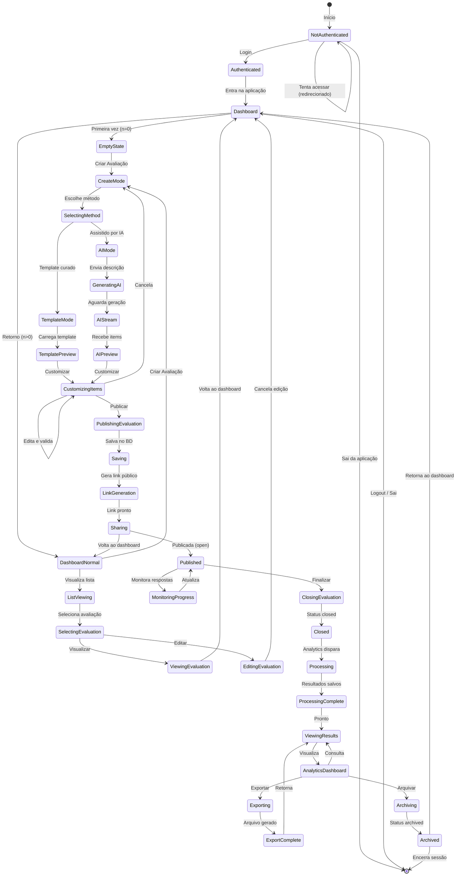

# Máquina de Estados Finitos - Ações do Usuário

Documentação da máquina de estados finitos (FSM) que representa o fluxo de ações do usuário no sistema Aevalo.

---

## 🔄 Diagrama FSM: Ciclo de Vida do Usuário



---

## 📋 Descrição dos Estados

| Estado | Descrição | Usuário | Ações Disponíveis |
|--------|-----------|---------|-------------------|
| **NotAuthenticated** | Usuário não logado | Visitante | Login, Tentar acesso |
| **Authenticated** | Credenciais validadas | Usuário | Entrar no dashboard |
| **Dashboard** | Página principal (roteador) | Owner | Criar avaliação, Visualizar lista |
| **EmptyState** | Primeira vez no sistema | Owner | Criar primeira avaliação |
| **DashboardNormal** | Histórico disponível | Owner | Criar nova, Selecionar existente |
| **ListViewing** | Visualiza lista de avaliações | Owner | Selecionar avaliação |
| **SelectingEvaluation** | Avaliação selecionada | Owner | Visualizar ou Editar |
| **ViewingEvaluation** | Modo leitura | Owner | Voltar ao dashboard |
| **EditingEvaluation** | Modo edição | Owner | Salvar alterações ou Cancelar |
| **CreateMode** | Modo de criação ativado | Owner | Escolher método |
| **SelectingMethod** | Escolhendo template vs IA | Owner | Template Curado OU Assistido por IA |
| **TemplateMode** | Carregar template pré-existente | Owner | Preview + Customizar |
| **TemplatePreview** | Template visualizado | Owner | Customizar ou Recomeçar |
| **AIMode** | Entrada para modo IA | Owner | Descrever avaliação |
| **GeneratingAI** | Prompt enviado ao LLM | Owner | Aguardar (SSE stream) |
| **AIStream** | Recebendo tokens em streaming | Owner | Aguardar conclusão |
| **AIPreview** | Items IA recebidos | Owner | Customizar ou Recomeçar |
| **CustomizingItems** | Editando items e validando | Owner | Publicar ou Cancelar |
| **PublishingEvaluation** | Iniciando publicação | Owner | Salvar avaliação |
| **Saving** | Salvando em BD (Supabase) | Owner | Aguardar conclusão |
| **LinkGeneration** | Gerando UUID + short URL | Owner | Aguardar conclusão |
| **Sharing** | Link público gerado | Owner | Compartilhar ou Voltar |
| **Published** | Avaliação ativa (status: open) | Owner | Monitorar ou Finalizar |
| **MonitoringProgress** | Visualizando respostas em tempo real | Owner | Atualizar stats |
| **ClosingEvaluation** | Processando fechamento | Owner | Aguardar transição |
| **Closed** | Avaliação fechada (status: closed) | Owner | Aguardar processamento |
| **Processing** | Analytics processando resultados | Sistema | Agregação de dados |
| **ProcessingComplete** | Resultados calculados e salvos | Sistema | Notificar usuário |
| **ViewingResults** | Resultados disponíveis | Owner | Visualizar gráficos/métricas |
| **AnalyticsDashboard** | Dashboard de análise | Owner | Consultar dados, Exportar, Arquivar |
| **Exporting** | Gerando arquivo de exportação | Owner | Aguardar download |
| **ExportComplete** | Arquivo pronto | Owner | Download ou Retornar |
| **Archived** | Avaliação arquivada (status: archived) | Owner | Retornar ao dashboard |

---

## 🔄 Descrição das Transições

### Grupo 1: Autenticação
| Transição | Gatilho | Condição | Sistema |
|-----------|---------|----------|---------|
| NotAuthenticated → Authenticated | Login | email + password válidos | JWT gerado |
| Authenticated → Dashboard | Entra | Token validado | RLS ativado |
| NotAuthenticated → NotAuthenticated | Tenta acesso | Sem token | Redirecionado para login |

### Grupo 2: Dashboard & Visualização
| Transição | Gatilho | Condição | Sistema |
|-----------|---------|----------|---------|
| Dashboard → EmptyState | Verifica | count(avaliações) == 0 | CTA exibido |
| Dashboard → DashboardNormal | Verifica | count(avaliações) > 0 | Lista carregada |
| DashboardNormal → ListViewing | Clica | - | Query SELECT |
| ListViewing → SelectingEvaluation | Clica em item | - | Carrega avaliação |

### Grupo 3: Modo de Criação
| Transição | Gatilho | Condição | Sistema |
|-----------|---------|----------|---------|
| CreateMode → SelectingMethod | Pronto | - | Dialog exibido |
| SelectingMethod → TemplateMode | Escolhe template | - | Templates carregados |
| SelectingMethod → AIMode | Escolhe IA | - | Input description |
| TemplateMode → TemplatePreview | Seleciona | - | Valida schema |

### Grupo 4: Caminho IA
| Transição | Gatilho | Condição | Sistema |
|-----------|---------|----------|---------|
| AIMode → GeneratingAI | Submete descrição | Validado | Prompt estruturado |
| GeneratingAI → AIStream | Envia | - | Streaming SSE |
| AIStream → AIPreview | Completa | Status 200 | JSON recebido |

### Grupo 5: Customização & Publicação
| Transição | Gatilho | Condição | Sistema |
|-----------|---------|----------|---------|
| TemplatePreview/AIPreview → CustomizingItems | Clica editar | - | Form inline |
| CustomizingItems → CustomizingItems | Edita | Validação OK | Estado mantém |
| CustomizingItems → PublishingEvaluation | Clica publicar | Válido | Transação BD |
| PublishingEvaluation → Saving | Confirma | - | INSERT/UPDATE |
| Saving → LinkGeneration | Status 200 | - | UUID gerado |
| LinkGeneration → Sharing | Link gerado | - | Preview exibido |
| Sharing → Published | Confirma compartilhar | - | status: open |

### Grupo 6: Monitoramento & Fechamento
| Transição | Gatilho | Condição | Sistema |
|-----------|---------|----------|---------|
| Published → MonitoringProgress | Clica monitorar | - | Realtime listener |
| MonitoringProgress → Published | Atualiza | Novo evento | UI refresca |
| Published → ClosingEvaluation | Clica finalizar | - | Transação iniciada |
| ClosingEvaluation → Closed | Confirma | - | status: closed |

### Grupo 7: Processamento & Análise
| Transição | Gatilho | Condição | Sistema |
|-----------|---------|----------|---------|
| Closed → Processing | Job despachado | - | Analytics iniciado |
| Processing → ProcessingComplete | Calcs OK | - | Results INSERT |
| ProcessingComplete → ViewingResults | Notify | - | Resultados prontos |

### Grupo 8: Resultados & Exportação
| Transição | Gatilho | Condição | Sistema |
|-----------|---------|----------|---------|
| ViewingResults → AnalyticsDashboard | Visualiza | - | Gráficos renderizados |
| AnalyticsDashboard → ViewingResults | Consulta | - | Dados recarregados |
| AnalyticsDashboard → Exporting | Clica exportar | - | Gerador iniciado |
| Exporting → ExportComplete | OK | Arquivo gerado | Download pronto |
| ExportComplete → ViewingResults | Retorna | - | Dashboard |
| AnalyticsDashboard → Archiving | Clica arquivar | - | Transação |
| Archiving → Archived | Status updated | - | status: archived |

### Grupo 9: Saída
| Transição | Gatilho | Condição | Sistema |
|-----------|---------|----------|---------|
| NotAuthenticated → [*] | Sai | - | Sessão encerrada |
| Dashboard → [*] | Logout | - | Token invalidado |
| Archived → [*] | Encerra | - | Sessão finalizada |

---

## 🎯 Fluxos Principais (Happy Paths)

### Path 1: Criação com Template
```
NotAuthenticated 
  → Authenticated 
  → Dashboard 
  → EmptyState 
  → CreateMode 
  → SelectingMethod 
  → TemplateMode 
  → TemplatePreview 
  → CustomizingItems 
  → PublishingEvaluation 
  → Saving 
  → LinkGeneration 
  → Sharing 
  → Published
```

### Path 2: Criação com IA
```
NotAuthenticated 
  → Authenticated 
  → Dashboard 
  → EmptyState 
  → CreateMode 
  → SelectingMethod 
  → AIMode 
  → GeneratingAI 
  → AIStream 
  → AIPreview 
  → CustomizingItems 
  → PublishingEvaluation 
  → Saving 
  → LinkGeneration 
  → Sharing 
  → Published 
  → MonitoringProgress 
  → ClosingEvaluation 
  → Closed 
  → Processing 
  → ProcessingComplete 
  → ViewingResults 
  → AnalyticsDashboard 
  → Archiving 
  → Archived
```

### Path 3: Visualizar & Editar Existente
```
Dashboard 
  → DashboardNormal 
  → ListViewing 
  → SelectingEvaluation 
  → EditingEvaluation 
  → Dashboard
```

---

## 🔐 Estados Críticos para Segurança

| Estado | Validações | RLS | Audit Log |
|--------|-----------|-----|-----------|
| Authenticated | JWT valido | Ativado | login_success |
| Published | Link UUID válido | Público (read-only) | eval_published |
| Closed | Owner verificado | Restricto | eval_closed |
| Processing | Job autorizado | Backend only | processing_start |
| ViewingResults | Owner/Collaborator | RLS | results_viewed |
| Archiving | Owner only | Restricto | eval_archived |

---

## 📊 Métricas por Estado

| Estado | Métrica Prometheus | Período Esperado |
|--------|------------------|-----------------|
| GeneratingAI | `llm_latency_ms` | 2-5s |
| AIStream | `tokens_per_second` | Monitorado |
| PublishingEvaluation | `publish_duration_ms` | <500ms |
| Processing | `analytics_duration_ms` | <10s |
| ViewingResults | `results_query_latency_ms` | <1s |

---

**Nota:** Esta máquina de estados finitos fornece uma visão completa de todos os estados possíveis e transições do usuário no sistema Aevalo. Pode ser expandida ou refinada conforme novos fluxos são implementados.
