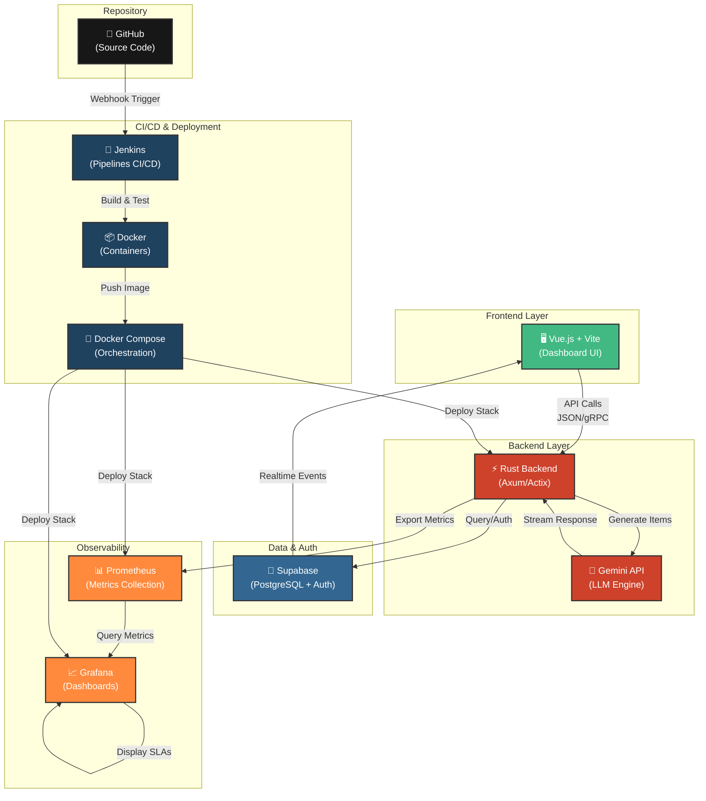

## 🛠 Especificação Técnica: Engine de Avaliações Customizáveis

Esta estrutura visa facilitar a criação de tarefas e a definição da arquitetura de banco de dados.

### 1. Autenticação e Onboarding (Módulo Auth)

* **Fluxo:** Implementação de JWT para persistência de sessão.
* **Empty State Logic:** O sistema deve validar o `count` de avaliações no primeiro render. Se `n == 0`, o Dashboard deve injetar um componente de *Onboarding CTA* (Call to Action) em vez da lista vazia.

### 2. Dashboard de Gestão (Módulo Data-Viz)

O dashboard será composto por três artefatos principais:

* **Searchable Evaluation List:** Tabela com paginação *server-side* e filtro via query params para a barra de pesquisa.
* **Analytics Engine:** Gráfico de barras agregando `evaluations` por `category_id`.
* **Status Tracker:** Card destacado para `status == 'open'`, permitindo acesso rápido.

### 3. Core: O Motor de Avaliação (Survey Engine)

Para suportar os modelos do *MeasuringU*, o schema de dados deve ser polimórfico.

* **Formatos Suportados:**
* **Likert & Frequency:** Escalas ordinais quantificadas.
* **Paired Comparison:** Lógica de "A vs B" com armazenamento de matriz de preferência.
* **Fixed Sum:** Validação no *client-side* para garantir que o somatório dos inputs seja exatamente  (ou o valor definido).

* **Categorização:** CRUD de categorias dinâmicas vinculadas ao `user_id`.

### 4. Inteligência Artificial e Modelagem (LLM Integration)

* **Modo Template:** Recuperação de objetos JSON pré-definidos.
* **Modo AI-Gen:** Integração via API (OpenAI/Anthropic).
* *Input:* Prompt estruturado com a descrição do usuário.
* *Output:* A LLM deve retornar um JSON estruturado seguindo o schema da aplicação para permitir a **customização imediata** antes da persistência no banco.

### 5. Colaboração e Acesso Público (Shared Workspace)

* **Invite System:** Geração de `short-urls` com UUIDs únicos para evitar *crawling*.
* **Role Management:** Diferenciação entre "Proprietário" (pode editar/finalizar) e "Avaliador" (apenas leitura e submissão).
* **State Control:** Botão de finalização que altera o status da avaliação para `closed`, desabilitando o link público e disparando o gatilho de processamento dos resultados.

---

### Stack Adotada

Essa é uma escolha de stack extremamente performática e moderna. O uso de **Rust** no backend garante segurança de memória e velocidade incomparável, enquanto o **Vue.js** oferece uma reatividade fluida para o dashboard. O **Supabase** acelera o desenvolvimento ao fornecer autenticação e banco de dados pronto para uso, e a **Gemini API** é a escolha nativa para integração de IA de última geração. Para observabilidade e monitoramento, **Prometheus** coleta métricas de performance e disponibilidade, enquanto **Grafana** fornece dashboards visuais para análise em tempo real. A orquestração de containers é gerenciada por **Docker** e **Docker Compose**, garantindo ambientes consistentes entre desenvolvimento, staging e produção. O pipeline de CI/CD é automatizado pelo **Jenkins**, proporcionando builds, testes e deploys contínuos com pipelines declarativos e integração nativa com Docker.

Ao adotar essa stack específica, podemos implementar melhorias de engenharia que não seriam viáveis em stacks convencionais:

* **Type Safety End-to-End:** Utilizar o compartilhamento de tipos entre o Rust (backend) e o Vue (via TypeScript) para garantir que a estrutura das escalas (Likert, Fixed Sum, etc.) nunca quebre entre o banco e o front.
* **Edge Computing com Supabase:** Utilizar *Edge Functions* para gatilhos rápidos de notificações ou validações leves, deixando o backend em Rust para o processamento pesado de dados e IA.
* **Streaming de Respostas da IA:** Aproveitar a velocidade do Rust para fazer o *stream* das sugestões da Gemini API em tempo real para o Vue, criando uma experiência de interface muito mais dinâmica para o usuário.
* **Segurança de Concorrência:** O Rust garantirá que, em avaliações com centenas de colaboradores simultâneos, não existam *race conditions* no cálculo dos resultados das escalas.
* **Observabilidade Completa:** Prometheus integrado ao backend Rust captura métricas de latência, throughput e erros, enquanto Grafana exibe dashboards customizados com alertas para SLAs críticos.
* **Portabilidade e Isolamento:** Docker containeriza cada serviço (backend, Prometheus, Grafana) garantindo ambientes idênticos em dev/prod, enquanto Docker Compose orquestra a stack completa com uma única configuração declarativa, facilitando deploys e rollbacks.
* **Automação de Deploy:** Jenkins executa pipelines declarativos (Jenkinsfile) que automatizam build, testes, análise de código e deploy para staging/produção, com rollback automático em caso de falhas e notificações integradas ao repositório.

---

#### 🛠 Tabela Descritiva da Stack Tecnológica

| Camada | Tecnologia | Função Principal | Vantagem Estratégica |
| --- | --- | --- | --- |
| **Frontend** | **Vue.js (Vite)** | Interface do Usuário e Dashboards Interativos. | Reatividade superior e facilidade na criação de componentes para as escalas complexas. |
| **Backend** | **Rust (Axum/Actix)** | API Core e Lógica de Negócio de alta performance. | Performance extrema, segurança de memória e execução eficiente de algoritmos de análise. |
| **IA Engine** | **Gemini API** | Geração de itens de avaliação e síntese de resultados. | Integração nativa de modelos multimodais com alta janela de contexto para descrições complexas. |
| **Banco de Dados** | **Supabase (PostgreSQL)** | Persistência de dados, Auth e Realtime. | SQL robusto para relações complexas entre categorias, com camada de Auth e Row Level Security (RLS) nativa. |
| **Comunicação** | **JSON / gRPC** | Protocolo de troca de dados entre Front e Back. | Latência mínima e estruturação rígida de dados para as metodologias do MeasuringU. |
| **Monitoramento** | **Prometheus** | Coleta de métricas (latência, requisições, erros). | Armazenamento time-series eficiente com alertas configuráveis e integração nativa com Rust. |
| **Observabilidade** | **Grafana** | Dashboards visuais e análise de métricas. | Visualização em tempo real de SLAs, performance e health checks com alertas customizáveis. |
| **Containerização** | **Docker** | Isolamento e empacotamento de serviços. | Ambientes reproduzíveis, isolamento de dependências e builds consistentes entre dev/prod. |
| **Orquestração** | **Docker Compose** | Gerenciamento multi-container local e staging. | Configuração declarativa de toda a stack (backend, DB, Prometheus, Grafana) com networking automático. |
| **CI/CD** | **Jenkins** | Automação de builds, testes e deploys. | Pipelines declarativos (Jenkinsfile), integração com Docker, execução de testes paralelos e deploy automatizado. |

---

#### 🏗 Fluxo de Produção de Artefatos (Dev Workflow)

1. **Definição do Schema (Supabase):** Criamos as tabelas de `evaluations`, `questions` e `responses` com RLS para que um usuário nunca veja a avaliação do outro.
2. **Desenvolvimento do Core (Rust):** Implementamos os validadores matemáticos para as escalas (ex: somatório da *Fixed Sum* e matriz de preferência da *Paired Comparison*).
3. **Integração IA (Gemini):** Criamos o serviço que recebe a descrição do usuário e retorna um `struct` de Rust mapeado para os modelos de avaliação.
4. **Interface Reativa (Vue):** Construímos o Dashboard que consome a API do Rust e utiliza as bibliotecas do Supabase para atualizações em tempo real quando um colaborador submete uma resposta.
5. **Observabilidade (Prometheus + Grafana):** Instrumentamos o backend Rust com métricas customizadas (tempo de resposta da IA, taxa de erro por endpoint, uso de recursos) exportadas para Prometheus, e configuramos dashboards no Grafana para monitoramento contínuo de SLAs e alertas proativos.
6. **Containerização (Docker + Compose):** Criamos Dockerfiles otimizados para cada serviço (multi-stage build para Rust, layers cacheadas para Vue) e um `docker-compose.yml` que orquestra backend, Prometheus, Grafana e serviços auxiliares, com volumes persistentes para dados e networking configurado para comunicação inter-container.
7. **CI/CD (Jenkins):** Configuramos pipelines declarativos que, a cada push no repositório, executam: build dos containers Docker, testes unitários e de integração, análise estática de código (linting), deploy automatizado para staging, validação de health checks, e promoção para produção mediante aprovação, com rollback automático em caso de falhas.

---

#### 🔄 Diagrama de Fluxo da Stack Aevalo

**Legenda do Diagrama:**

- **🖥️ Frontend (Verde):** Interface Vue.js com Vite, responsiva e reativa
- **⚡ Backend (Vermelho):** API Rust otimizada para performance e segurança
- **🤖 IA (Vermelho):** Integração com Gemini API para geração automática de itens
- **🔐 Data (Azul):** Supabase para persistência, autenticação e realtime
- **📊 Observability (Laranja):** Stack Prometheus + Grafana para monitoramento contínuo
- **🔄 CI/CD (Cinza):** Jenkins orquestra pipelines de build, test e deploy
- **📦 Deployment (Cinza):** Docker e Docker Compose garantem ambientes reproducíveis
- **🌳 Repository (Preto):** GitHub dispara pipelines CI/CD automaticamente

**Fluxo Resumido:**

1. Desenvolvedor faz push → GitHub dispara Jenkins
2. Jenkins executa build, testes e cria containers Docker
3. Docker Compose orquestra deploy (Rust, Prometheus, Grafana)
4. Frontend (Vue) consome API Rust via JSON/gRPC
5. Backend Rust integra com Supabase para dados e Gemini para IA
6. Prometheus coleta métricas do Rust
7. Grafana exibe dashboards e alertas
8. Supabase notifica Frontend de atualizações em realtime
