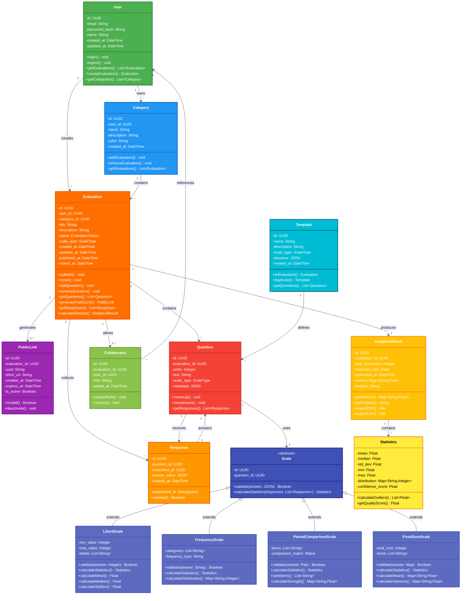

# 📦 Diagrama de Classes UML - Aevalo

Documentação da arquitetura de classes do sistema Aevalo usando UML.

---

## 🏗️ Diagrama de Classes: Modelo de Dados Completo



---

## 📋 Descrição das Classes

### 🔑 Core Entities

#### **User**
Representa o proprietário/criador de avaliações
- **Atributos:** ID, email, senha hasheada, nome, timestamps
- **Métodos:** Login/logout, gerenciar avaliações e categorias
- **Relações:** Possui múltiplas avaliações e categorias

#### **Category**
Organiza avaliações por tópicos personalizados
- **Atributos:** ID, user_id, nome, descrição, cor
- **Métodos:** Adicionar/remover avaliações, listar avaliações
- **Relações:** Pertence a um usuário, contém múltiplas avaliações

#### **Evaluation**
Representação principal de uma avaliação
- **Atributos:** ID, tipo de escala, status, timestamps
- **Métodos:** Publicar, fechar, gerenciar questões, gerar link público
- **Relações:** Pertence a um usuário/categoria, contém questões e respostas

#### **Question**
Questão individual dentro de uma avaliação
- **Atributos:** ID, texto, tipo de escala, ordem, metadados
- **Métodos:** Reordenar, obter respostas
- **Relações:** Pertence a uma avaliação, recebe múltiplas respostas

#### **Response**
Resposta individual de um respondente
- **Atributos:** ID, valor da resposta (JSON), timestamp, respondente (anônimo)
- **Métodos:** Validar resposta
- **Relações:** Responde a uma questão

---

### 📏 Scale Types (Polimorfismo)

#### **Scale** (Classe Abstrata)
Classe base para todos os tipos de escala

#### **LikertScale**
Escala 1-5 com labels personalizados
- **Métodos:** Validar valor inteiro, calcular média/mediana/desvio padrão

#### **FrequencyScale**
Escala categórica com frequência
- **Métodos:** Validar categoria, calcular distribuição

#### **PairedComparisonScale**
Comparação "A vs B" com ranking
- **Métodos:** Validar pares, rankear itens, calcular força relativa

#### **FixedSumScale**
Distribuição de pontos com somatório fixo
- **Métodos:** Validar somatório, calcular média ponderada

---

### 🔗 Collaboration & Access

#### **PublicLink**
Link compartilhável para avaliar sem login
- **Atributos:** UUID, short URL, data de expiração, status ativo
- **Métodos:** Validar link, desativar link
- **Relações:** Referencia uma avaliação

#### **Collaborator**
Define role de colaboradores em uma avaliação
- **Atributos:** Avaliação, usuário, role (owner/editor/viewer)
- **Métodos:** Atualizar role, remover colaborador
- **Roles:** OWNER (controle total), EDITOR (editar), VIEWER (ler apenas)

---

### 📊 Results & Analytics

#### **AnalyticsResult**
Resultados agregados de uma avaliação finalizada
- **Atributos:** Taxa de resposta, métricas, insights, data de geração
- **Métodos:** Exportar PDF/CSV, obter insights
- **Relações:** Contém múltiplas estatísticas

#### **Statistics**
Estatísticas calculadas por questão
- **Atributos:** Média, mediana, desvio padrão, distribuição, score de qualidade
- **Métodos:** Detectar outliers, calcular qualidade

---

### 📋 Templates

#### **Template**
Modelo pré-definido para acelerar criação
- **Atributos:** Nome, descrição, estrutura JSON, tipo de escala
- **Métodos:** Converter para avaliação, duplicar
- **Relações:** Define questões padrão

---

## 🔗 Relacionamentos Principais

| De | Para | Tipo | Cardinalidade | Descrição |
|---|---|---|---|---|
| **User** | **Evaluation** | Ownership | 1 : * | Um usuário cria múltiplas avaliações |
| **User** | **Category** | Ownership | 1 : * | Um usuário possui múltiplas categorias |
| **Category** | **Evaluation** | Composition | 1 : * | Uma categoria contém múltiplas avaliações |
| **Evaluation** | **Question** | Composition | 1 : * | Uma avaliação contém múltiplas questões |
| **Question** | **Response** | Aggregation | 1 : * | Uma questão recebe múltiplas respostas |
| **Evaluation** | **PublicLink** | Association | 1 : 0..* | Uma avaliação gera múltiplos links públicos |
| **Evaluation** | **AnalyticsResult** | Composition | 1 : 1 | Uma avaliação produz um resultado |
| **Scale** | **LikertScale** | Inheritance | 1 : 1 | Herança de tipo de escala |
| **Collaborator** | **User** | Reference | * : 1 | Múltiplos colaboradores por usuário |

---

## 💾 Serialização e Persistência

### Evaluation
```json
{
  "id": "uuid-eval-001",
  "user_id": "uuid-user-001",
  "category_id": "uuid-cat-001",
  "title": "Avaliação de Desempenho",
  "status": "OPEN",
  "scale_type": "LIKERT",
  "created_at": "2026-01-29T10:00:00Z"
}
```

### Question
```json
{
  "id": "uuid-q-001",
  "evaluation_id": "uuid-eval-001",
  "text": "Como você avalia a qualidade?",
  "scale_type": "LIKERT",
  "metadata": {
    "min": 1,
    "max": 5,
    "labels": ["Muito Ruim", "Ruim", "Neutro", "Bom", "Muito Bom"]
  }
}
```

### Response
```json
{
  "id": "uuid-resp-001",
  "question_id": "uuid-q-001",
  "answer_value": 4,
  "created_at": "2026-01-29T11:00:00Z"
}
```

---

## 🎯 Padrões de Design Utilizados

| Padrão | Uso | Exemplo |
|---|---|---|
| **Strategy** | Diferentes tipos de escala | Scale abstrata com implementations |
| **Template Method** | Cálculo de estatísticas | Cada escala implementa seu algoritmo |
| **Observer** | Realtime updates | Supabase notifica mudanças |
| **Builder** | Criar avaliações complexas | Evaluation builder com fluent API |
| **Repository** | Persistência de dados | Supabase query abstraction |

---

## 📈 Evolução Futura

Possíveis extensões da arquitetura:

- **Nested Questions:** Questões condicionais baseadas em respostas anteriores
- **Multi-language:** Suporte a múltiplos idiomas
- **Versioning:** Histórico de versões de avaliações
- **Permissions:** Sistema granular de permissões
- **Webhooks:** Notificações para sistemas externos
- **Custom Scales:** Extensão para tipos de escala customizados

---

**Última atualização:** January 29, 2026  
**Versão:** 1.0
