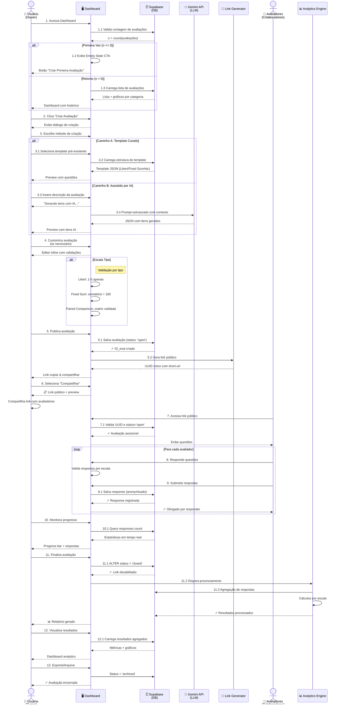
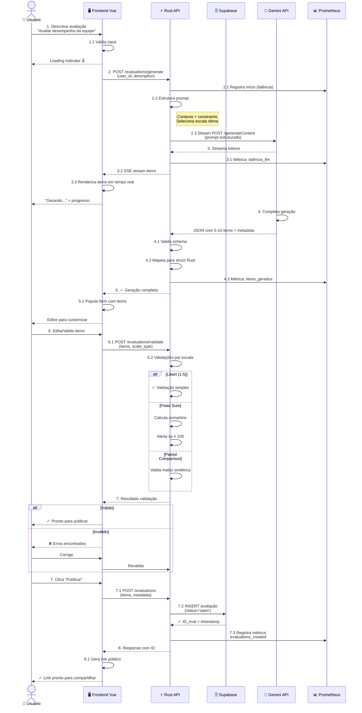
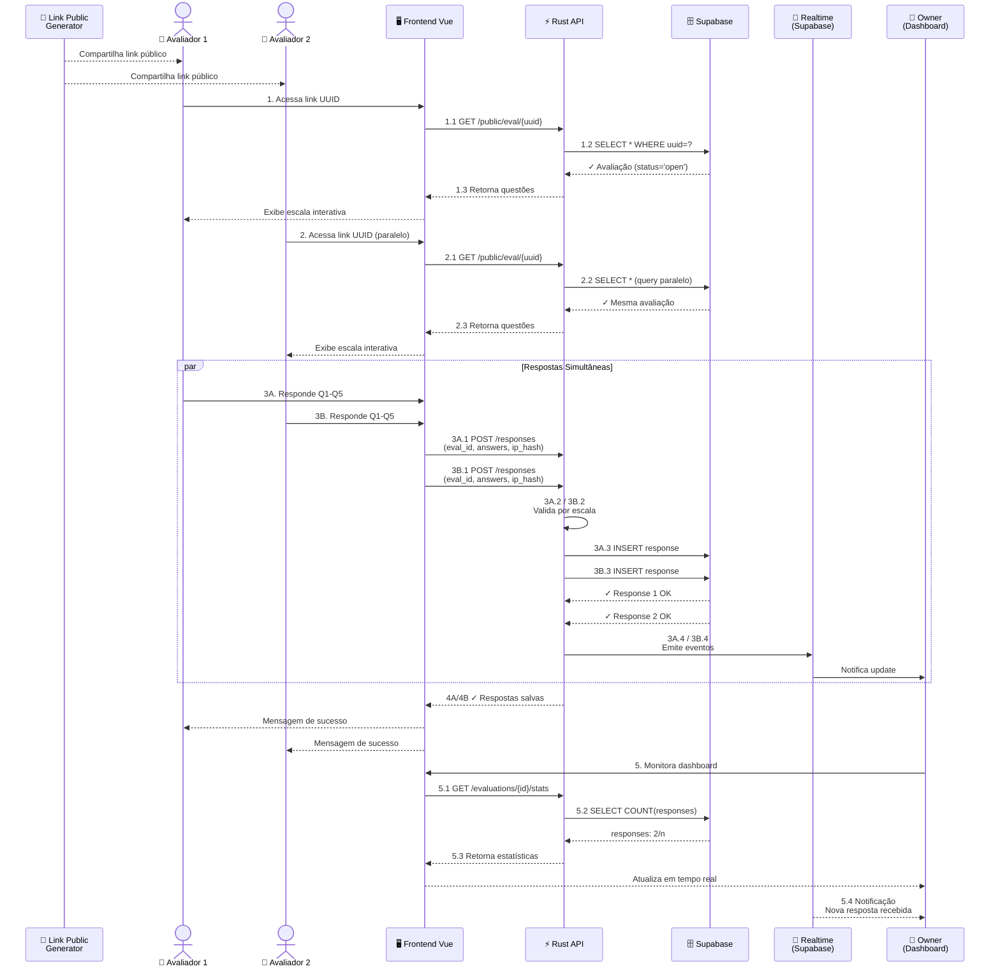
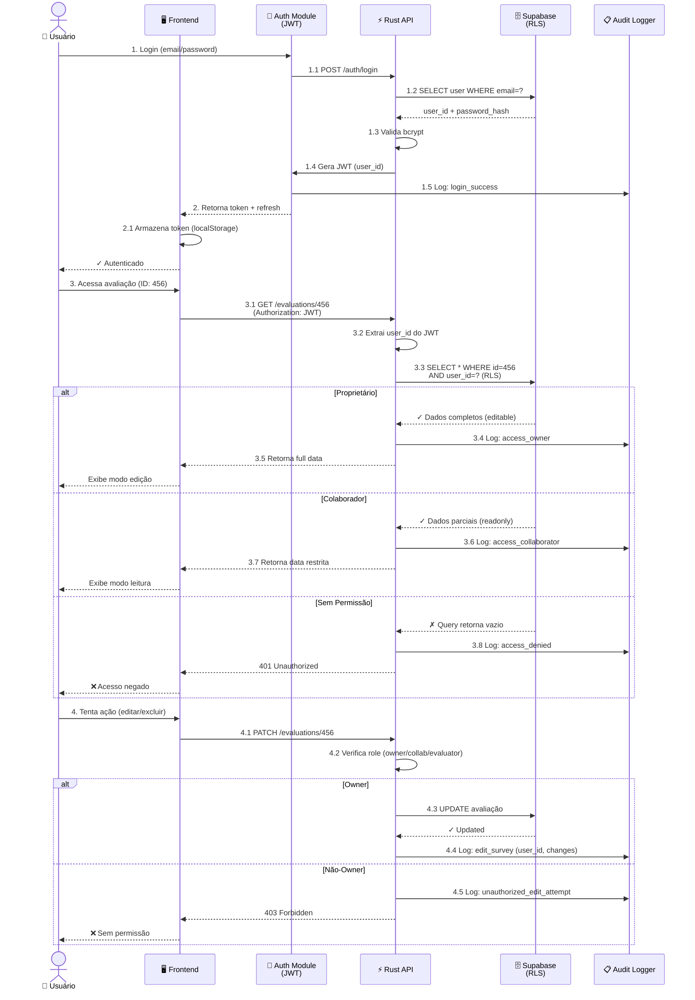
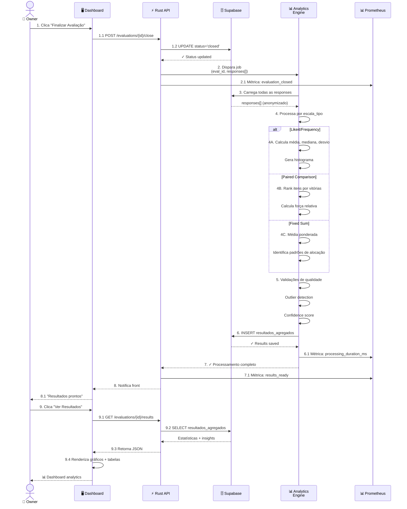

# Diagramas de Sequência UML - Aevalo

Documentação visual dos fluxos do sistema Aevalo usando diagramas UML.

---

## 🔄 Diagrama de Sequência: Fluxo Completo de Avaliação

---

## 🎯 Diagrama de Sequência: Fluxo Alternativo - Criação via IA (Detalhado)

---

## 📈 Diagrama de Sequência: Coleta de Respostas (Multi-usuário)

---

## 🔐 Diagrama de Sequência: Segurança e Controle de Acesso

---

## 📊 Diagrama de Sequência: Processamento de Resultados

---

## Legenda de Componentes

| Símbolo | Componente | Descrição |
|---------|-----------|-----------|
| 👤 | Usuário/Owner | Criador da avaliação |
| 👥 | Avaliadores | Colaboradores respondendo |
| 🖥️ | Frontend Vue | Interface React com Vite |
| ⚡ | Rust API | Backend com Axum/Actix |
| 🗄️ | Supabase | PostgreSQL + Auth + RLS |
| 🤖 | Gemini API | LLM para geração de itens |
| 🔗 | Link Generator | UUID + short URLs |
| 🔐 | Auth Module | JWT + Segurança |
| 📊 | Analytics | Processamento de resultados |
| 📊 | Prometheus | Métricas e monitoramento |
| 🔄 | Realtime | Supabase Realtime |

---

**Nota:** Todos os diagramas são gerados em Mermaid e podem ser editados/expandidos conforme necessário durante o desenvolvimento.
